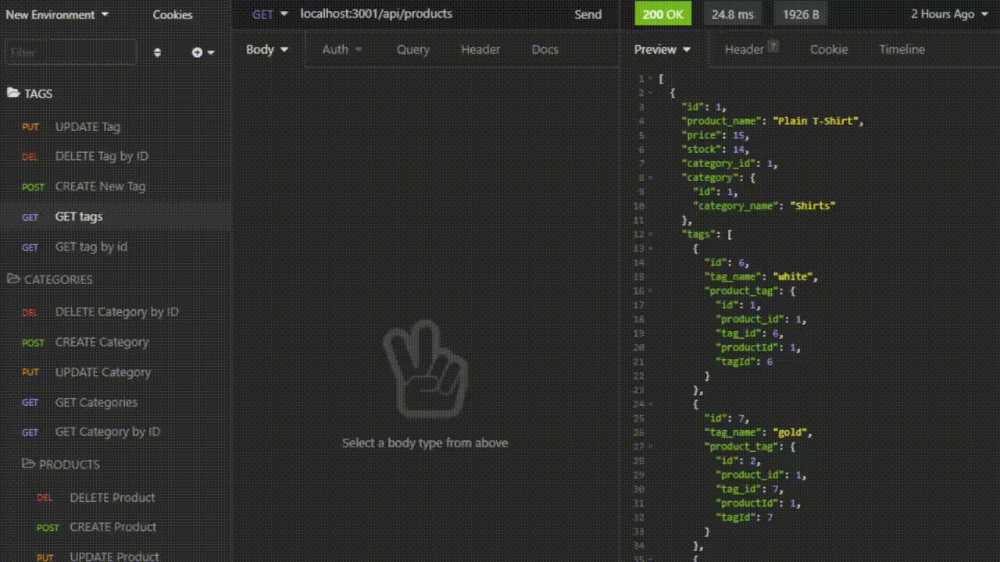
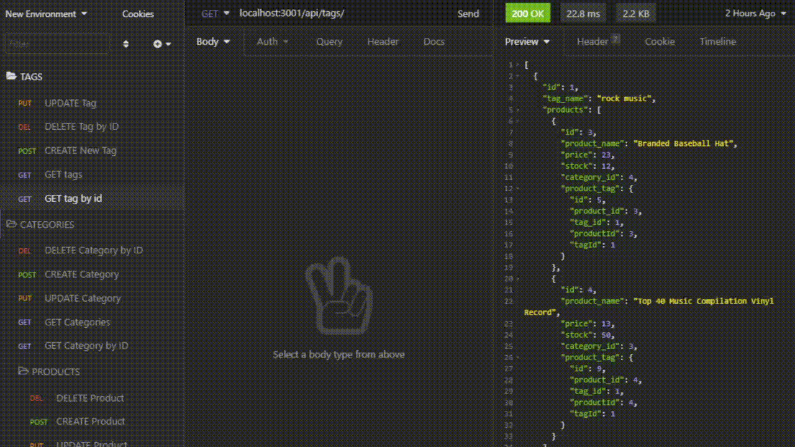
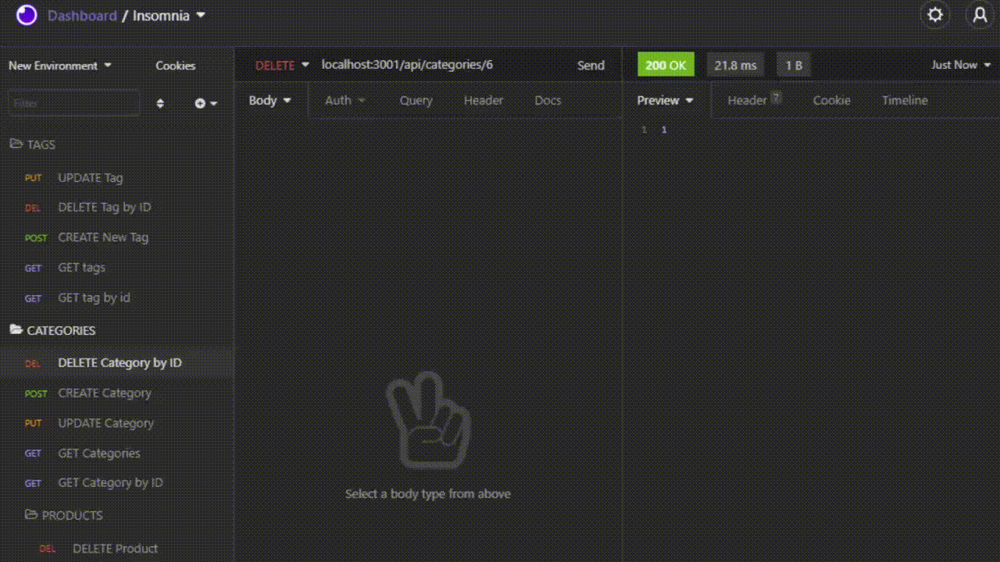

# E-Commerce Back End

MIT 

## Background Info / Task At Hand

Internet retail, also known as **e-commerce**, is the largest sector of the electronics industry, generating an estimated $29 trillion in 2019. E-commerce platforms like Shopify and WooCommerce provide a suite of services to businesses of all sizes. Due to their prevalence, understanding the fundamental architecture of these platforms will benefit you as a full-stack web developer.

My task was to build the back end for an e-commerce database. I configured a working Express.js API to use Sequelize to interact with a MySQL database. GET, POST, UPDATE, DELETE methods can be implimented through the Insomnia application.

## Link to site:

https://github.com/MattCross01/EcommerceBackEnd

## Demonstrations

GET routes to return all categories, all products, and all tags being tested.

GET routes to return a single category, a single product, and a single tag being tested.

POST, PUT, and DELETE routes for categories being tested.

=================================================

  
  

  Feel free to reach me at mountaindew2141@outlook.com with any question regarding this project!

